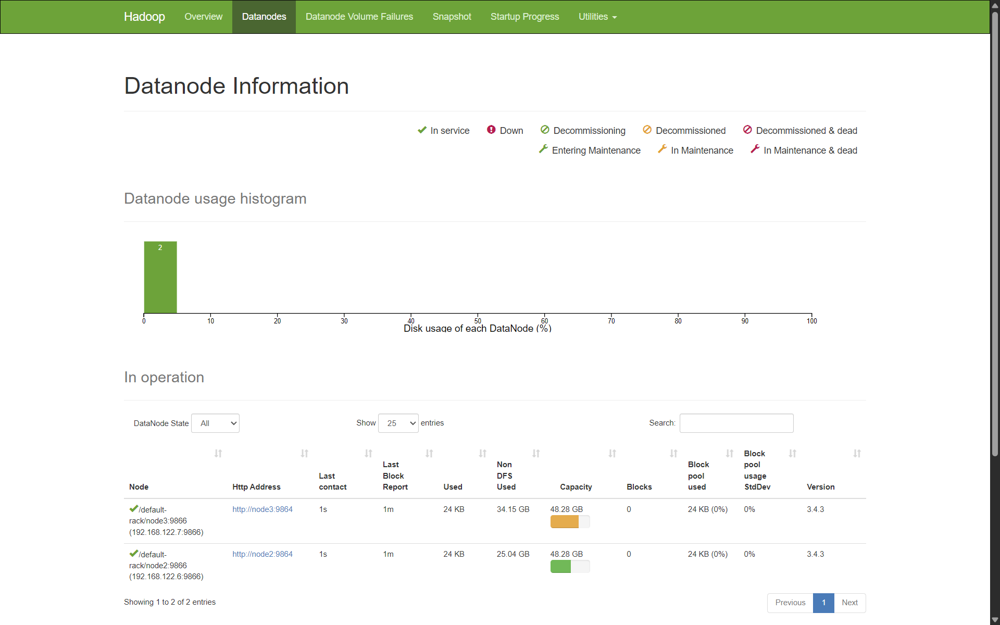

# HDFS + MapReduce

## Tạo cụm HDFS gồm 3 node dữ liệu

### Mô hình cluster

| Node | Hostname | Vai trò | IP |
| --- | ------- | --------- | --- |
| 1 | node1 | NameNode | 192.168.122.5 |
| 2 | node2 | DataNode | 192.168.122.6 |
| 3 | node3 | DataNode | 192.168.122.7 |

#### Chuẩn bị trên cả 3 Nodes

1. Cài đặt OpenJDK 11:

```bash
sudo apt update && sudo apt upgrade -y
sudo apt install openjdk-11-jdk -y

# Check java version
java -version
```

2. Tạo user `hadoop` và thư mục home:

```bash
sudo adduser hadoop
sudo usermod -aG sudo hadoop
su - hadoop
```

3. Cấu hình /etc/hosts (trên cả 3 node)

Lưu ý nhớ bỏ dòng `127.0.1.1 node1` đi trên node1 để tránh xung đột hostname:

```txt
192.168.122.5  node1
192.168.122.6  node2
192.168.122.7  node3
```

#### Cấu hình SSH không mật khẩu

```bash
# On node1
ssh-keygen -t ed25519 -P ""
cat ~/.ssh/id_ed25519.pub >> ~/.ssh/authorized_keys
# Copy the public key to node2 and node3
# Login into node2
mkdir -p ~/.ssh
nano ~/.ssh/authorized_keys
# Paste the public key from node1 and save
# Login into node3
mkdir -p ~/.ssh
nano ~/.ssh/authorized_keys
# Paste the public key from node1 and save
```

Sau đó trên node1, sửa file `.ssh/config` để thêm cấu hình cho các node:

```bash
Host node2
  HostName 192.168.122.6
  User hadoop
  IdentityFile ~/.ssh/id_ed25519

Host node3
  HostName 192.168.122.7
  User hadoop
  IdentityFile ~/.ssh/id_ed25519
```

Kiểm tra kết nối SSH không mật khẩu:

```bash
ssh node2
ssh node3
```

### Cài đặt Hadoop (trên cả 3 node)

1. Tải và giải nén Hadoop 3.4.3:

```bash
su - hadoop
wget https://dlcdn.apache.org/hadoop/common/hadoop-3.4.3/hadoop-3.4.3.tar.gz
tar -xzf hadoop-3.4.3.tar.gz
mv hadoop-3.4.3 hadoop
```

2. Thiết lập biến môi trường:

```bash
nano ~/.bashrc
```

Thêm vào cuối file:

```bash
export HADOOP_HOME=/home/hadoop/hadoop
export HADOOP_CONF_DIR=$HADOOP_HOME/etc/hadoop
export PATH=$PATH:$HADOOP_HOME/bin:$HADOOP_HOME/sbin
export HDFS_NAMENODE_USER=hadoop
export HDFS_DATANODE_USER=hadoop
export HDFS_SECONDARYNAMENODE_USER=hadoop
```

Nạp lại file .bashrc:

```bash
source ~/.bashrc
```

2. Cấu hình JAVA_HOME trong hadoop-env.sh:

```bash
nano $HADOOP_HOME/etc/hadoop/hadoop-env.sh
```

Thêm dòng sau vào cuối file:

```bash
export JAVA_HOME=/usr/lib/jvm/java-11-openjdk-amd64
```

### Cấu hình Hadoop (trên cả 3 node)

#### core-site.xml

```bash
nano $HADOOP_HOME/etc/hadoop/core-site.xml
```

```bash
<configuration>
  <property>
    <name>fs.defaultFS</name>
    <value>hdfs://node1:9000</value>
  </property>
  <property>
    <name>hadoop.tmp.dir</name>
    <value>/home/hadoop/hadoopdata/tmp</value>
  </property>
</configuration>
```

#### hdfs-site.xml

```bash
nano $HADOOP_HOME/etc/hadoop/hdfs-site.xml
```

```bash
<configuration>
  <!-- Replication factor = 2 -->
  <property>
    <name>dfs.replication</name>
    <value>2</value>
  </property>

  <!-- NameNode directory -->
  <property>
    <name>dfs.namenode.name.dir</name>
    <value>file:///home/hadoop/hadoopdata/namenode</value>
  </property>

  <!-- DataNode directory -->
  <property>
    <name>dfs.datanode.data.dir</name>
    <value>file:///home/hadoop/hadoopdata/datanode</value>
  </property>

  <!-- Secondary NameNode -->
  <property>
    <name>dfs.namenode.secondary.http-address</name>
    <value>node1:9868</value>
  </property>
</configuration>
```

#### mapred-site.xml

```bash
nano $HADOOP_HOME/etc/hadoop/mapred-site.xml
```

```bash
<configuration>
  <property>
    <name>mapreduce.framework.name</name>
    <value>yarn</value>
  </property>
  <property>
    <name>yarn.app.mapreduce.am.env</name>
    <value>HADOOP_MAPRED_HOME=/home/hadoop/hadoop</value>
  </property>
  <property>
    <name>mapreduce.map.env</name>
    <value>HADOOP_MAPRED_HOME=/home/hadoop/hadoop</value>
  </property>
  <property>
    <name>mapreduce.reduce.env</name>
    <value>HADOOP_MAPRED_HOME=/home/hadoop/hadoop</value>
  </property>
  <property>
    <name>mapreduce.application.classpath</name>
    <value>$HADOOP_HOME/share/hadoop/mapreduce/*:$HADOOP_HOME/share/hadoop/mapreduce/lib/*</value>
  </property>
</configuration>
```

#### yarn-site.xml

```bash
<configuration>
  <property>
    <name>yarn.nodemanager.aux-services</name>
    <value>mapreduce_shuffle</value>
  </property>
  <property>
    <name>yarn.resourcemanager.hostname</name>
    <value>node1</value>
  </property>
</configuration>
```

#### Worker configuration

```bash
nano $HADOOP_HOME/etc/hadoop/workers
```

Xoá hết nội dung mặc định và thêm vào:

```bash
node2
node3
```

#### Tạo thư mục dữ liệu (trên cả 3 node)

```bash
mkdir -p /home/hadoop/hadoopdata/tmp
mkdir -p /home/hadoop/hadoopdata/namenode
mkdir -p /home/hadoop/hadoopdata/datanode
```

#### Đồng bộ cấu hình từ node1 sang node2 và node3

```bash
scp $HADOOP_HOME/etc/hadoop/* hadoop@node1:$HADOOP_HOME/etc/hadoop/
scp $HADOOP_HOME/etc/hadoop/* hadoop@node2:$HADOOP_HOME/etc/hadoop/
```

### Format HDFS và khởi động cluster

Trên node1, chạy lệnh sau để format HDFS:

```bash
hdfs namenode -format
```

Sau đó khởi động cluster:

```bash
start-dfs.sh && start-yarn.sh
```

### Kiểm tra trạng thái cluster

Truy cập vào giao diện web của NameNode:

- NameNode UI: http://node1:9870



- ResourceManager UI: http://node1:8088
